# Display Filter
## Soal 1
### Pertanyaan: 
Sebutkan webserver yang digunakan pada "testing.mekanis.me"!

### Jawaban:

Filter menggunakan
```
http.host contains testing.mekanis.me
```
Jika diklik pada bagian `Server` akan terlihat bahwa webserver yang digunakan adalah `nginx/1.14.0 (Ubuntu)`

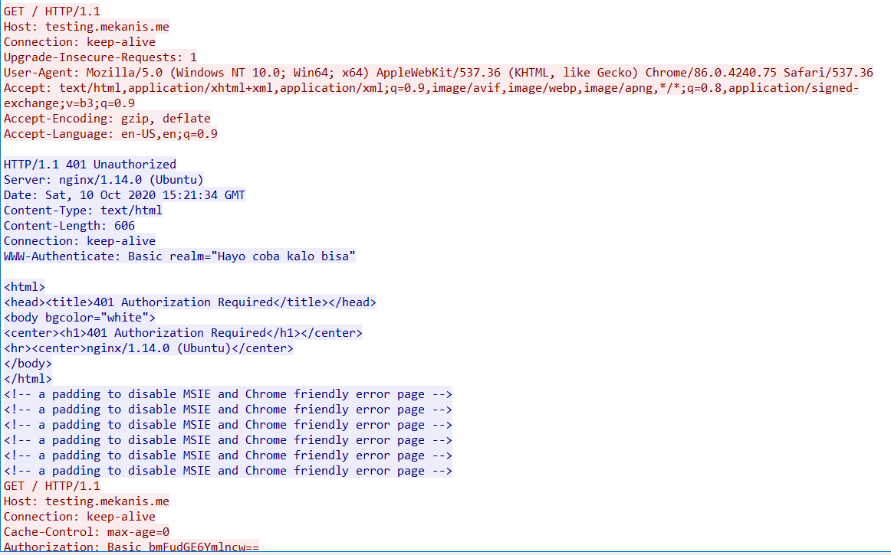

## Soal 2
### Pertanyaan: 
Simpan gambar "Tim_Kunjungan_Kerja_BAKN_DPR_RI_ke_Sukabumi141436.jpg"!

### Jawaban:

Filter menggunakan
```
http.host contains testing.mekanis.me
```
Klik **File** -> **Export Object** -> **Http** -> **Save** pada file yang diinginkan

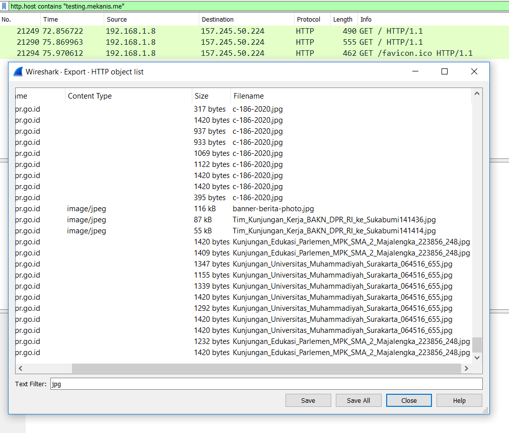

## Soal 3
### Pertanyaan: 
Cari username dan password ketika login di "ppid.dpr.go.id"!

### Jawaban:

Filter menggunakan
```
http.host contains “ppid.dpr.go.id”
```
Lihat pada paket yang memiliki **POST**, akan ditemukan *username* 10pemuda *password* guncangdunia 

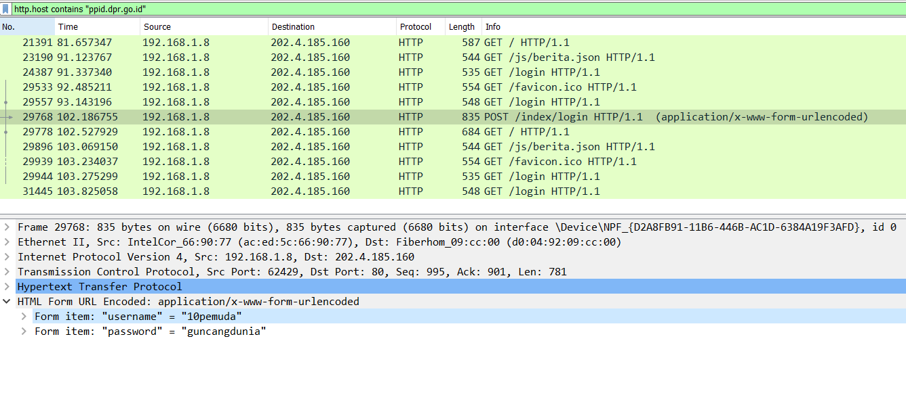

## Soal 4
### Pertanyaan: 
Temukan paket dari web-web yang menggunakan basic authentication method!

### Jawaban:

Filter menggunakan
```
http.authbasic
```

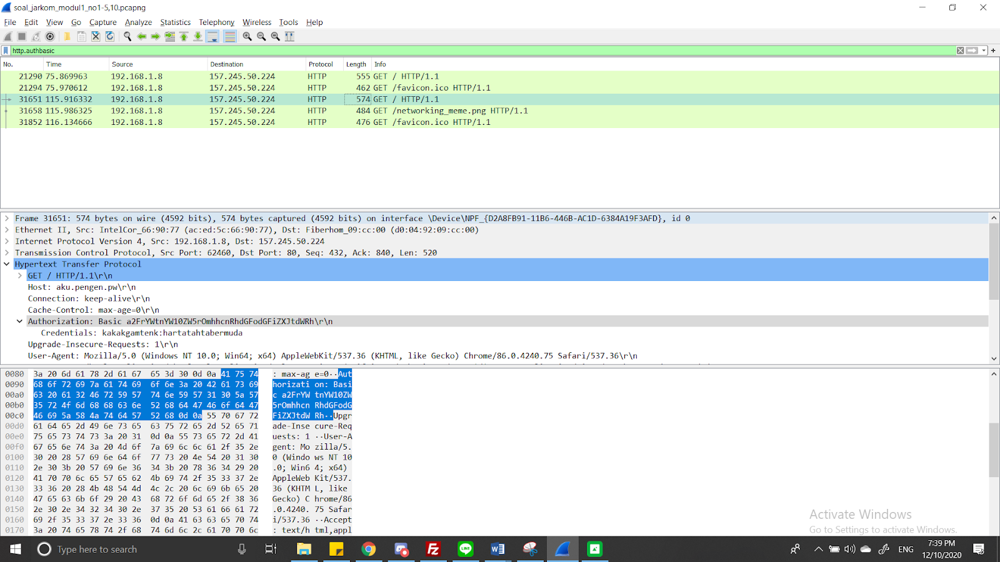

## Soal 5
### Pertanyaan: 
Ikuti perintah di aku.pengen.pw! Username dan password bisa didapatkan dari file .pcapng!

### Jawaban:

Filter menggunakan
```
http.host contains “aku.pengen.pw”
```
Jika [aku.pengen.pw] dibuka pada browser maka kita akan diminta username dan password. Keduanya dapat ditemukan pada paket yang didapat menggunakan filter yang sudah disebutkan. Dengan *username*: kakakgamtenk dan *pass*: hartatahtabermuda.

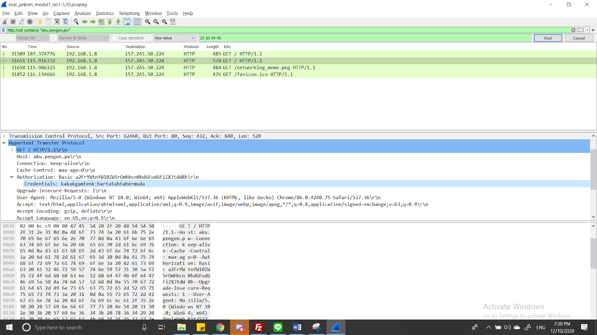

Setelah login, muncul soal untuk menyebutkan urutan konfigurasi pengkabelan T568B.

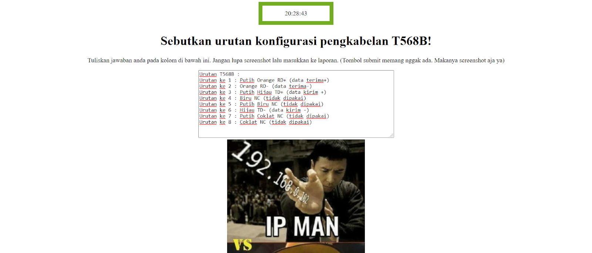

## Soal 6
### Pertanyaan: 
Seseorang menyimpan file zip melalui FTP dengan nama "Answer.zip". Simpan dan Buka file "Open This.pdf" di Answer.zip. Untuk mendapatkan password zipnya, temukan dalam file zipkey.txt (passwordnya adalah isi dari file txt tersebut).

### Jawaban:

Filter menggunakan
```
ftp-data.command contains "STOR Answer.zip"
dan
ftp-data.command contains "STOR zipkey.txt"
```
Pilih salah satu pake, untuk menyimpan file zip klik kanan -> **Follow** -> **TCP Stream** -> Pilih **Raw** pada Show and save data as -> **Save as**.

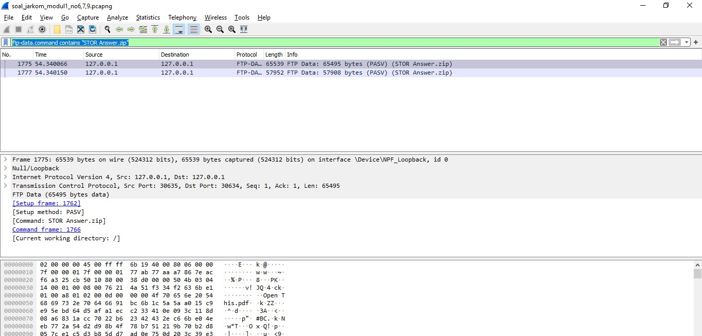

Untuk mendapatkan pass, jalankan filter kedua lalu follow TCP Stream maka akan langsung terlihat passnya.

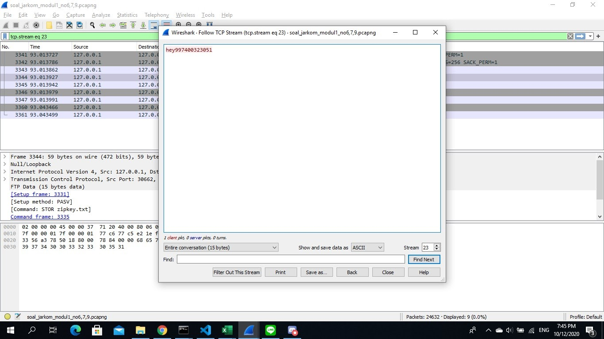

Gunakan pass tersebut untuk meng-*extract* file zip tadi. Akan didapatkan file `Open This.pdf`, jika dibuka akan tampil foto kocheng seperti berikut.

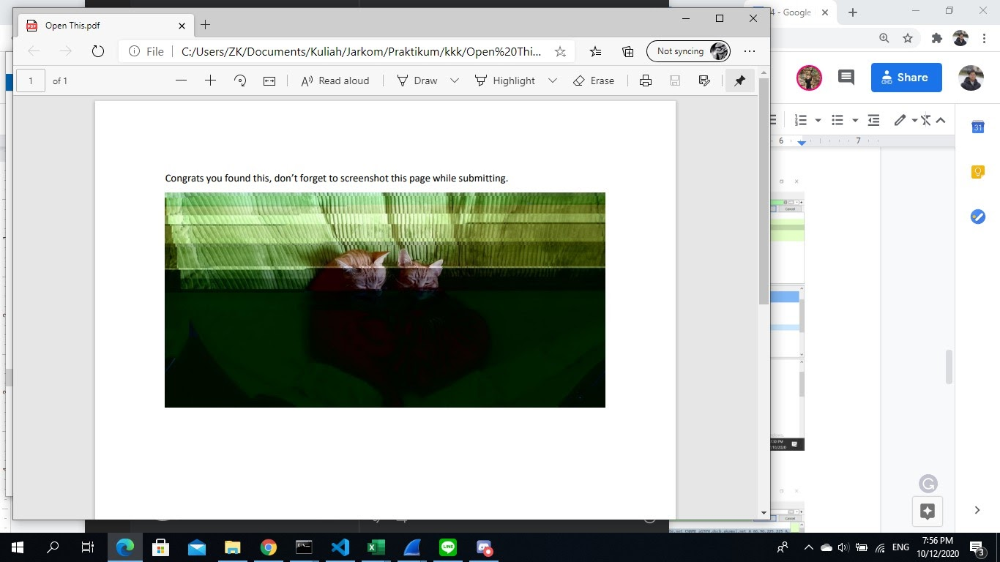

## Soal 7
### Pertanyaan: 
Ada 500 file zip yang disimpan ke FTP Server dengan nama 1.zip, 2.zip, ..., 500.zip. Salah satunya berisi pdf yang berisi puisi. Simpan dan Buka file pdf tersebut.
Your Super Mega Ultra Rare Hint = nama pdf-nya "Yes.pdf"

### Jawaban:

Filter menggunakan
```
ftp-data contains "Yes.pdf"
```
Dengan filter tersebut kita bisa mendapatkan file yang berisi *Yes.pdf* di dalamanya. Save menggunakan TCP Stream, lalu extract, kita akan mendapatkan file pdf tersebut.

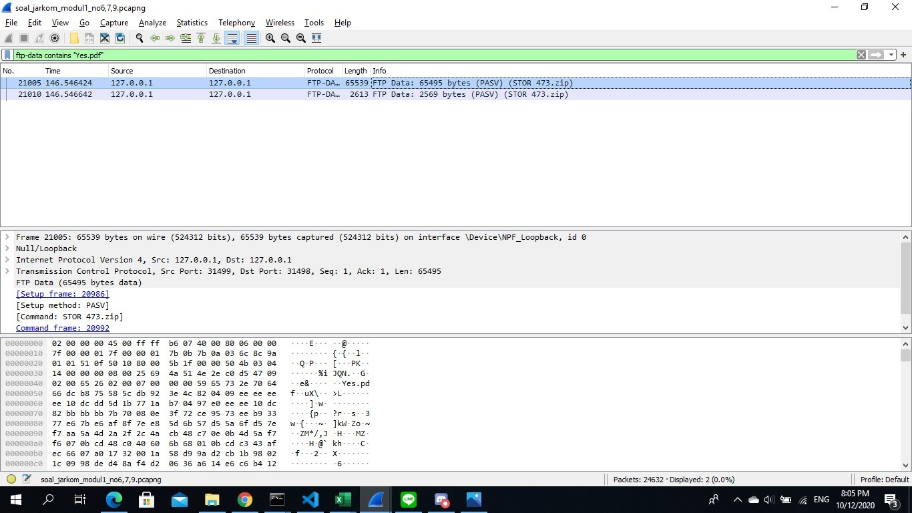
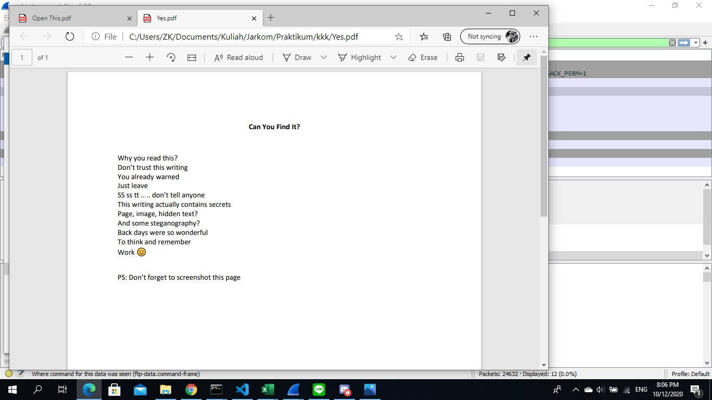

## Soal 8
### Pertanyaan: 
Cari objek apa saja yang didownload (RETR) dari koneksi FTP dengan Microsoft FTP Service!

### Jawaban:

Filter menggunakan
```
ftp.request.command contains "RETR"
```

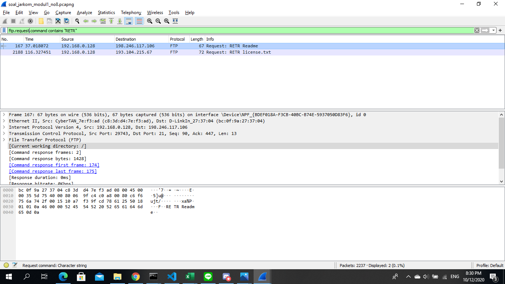
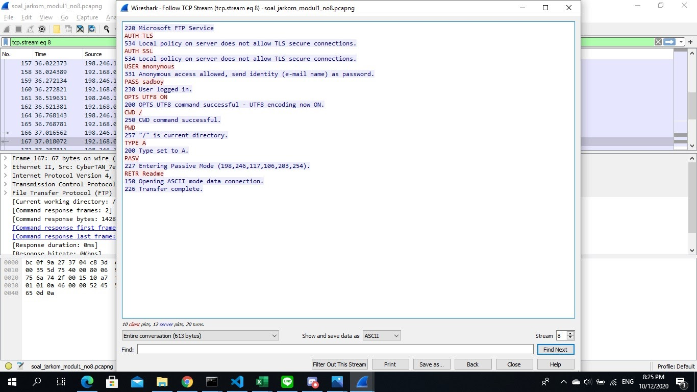

## Soal 9
### Pertanyaan: 
Cari username dan password ketika login FTP pada localhost!

### Jawaban:

Filter menggunakan
```
ftp contains "USER" or ftp contains "PASS"
```
User: dhana
Pass: dhana123

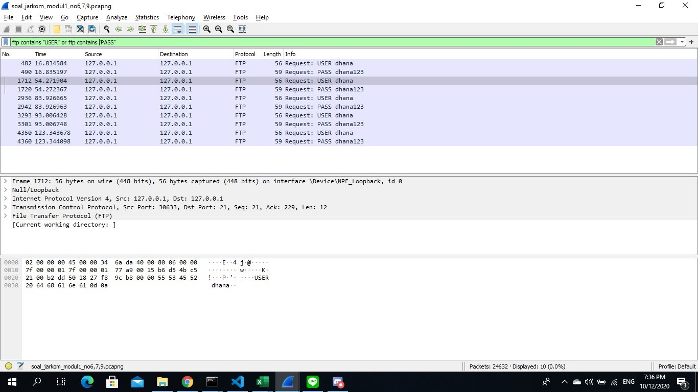

## Soal 10
### Pertanyaan: 
Cari file .pdf di wireshark lalu download dan buka file tersebut!
clue: "25 50 44 46"

### Jawaban:
ctrl+f cari "25 50 44 46", sebelumnya ubah ke hex value. Klik kanan udp stream, ubah ke raw. Lalu save

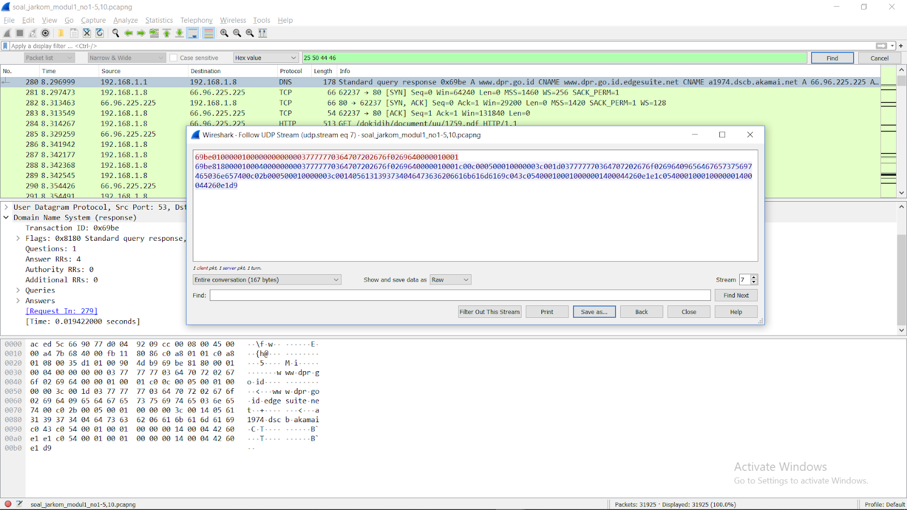

# Capture Filter
## Soal 11
### Pertanyaan: 
Filter sehingga wireshark hanya mengambil paket yang mengandung port 21!

### Jawaban:

Filter menggunakan
```
tcp.port == 21
```
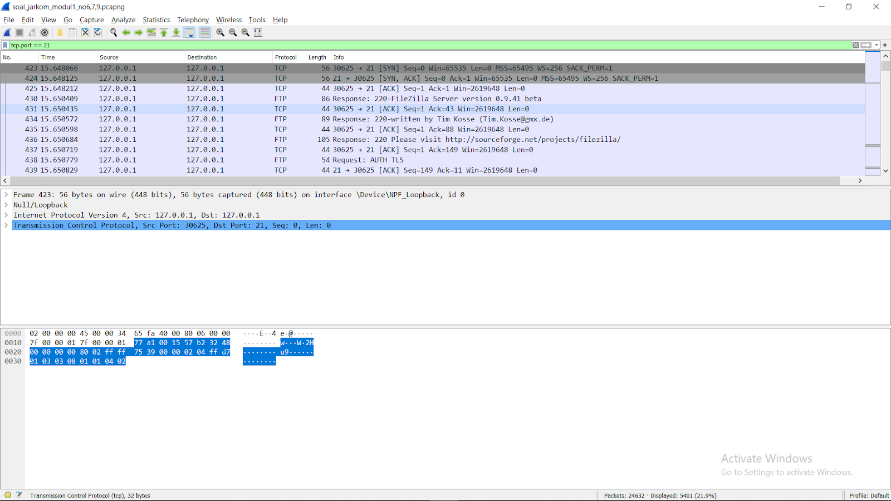

## Soal 12
### Pertanyaan: 
Filter sehingga wireshark hanya mengambil paket yang berasal dari port 80!

### Jawaban:

Filter menggunakan
```
tcp.srcport == 80
```

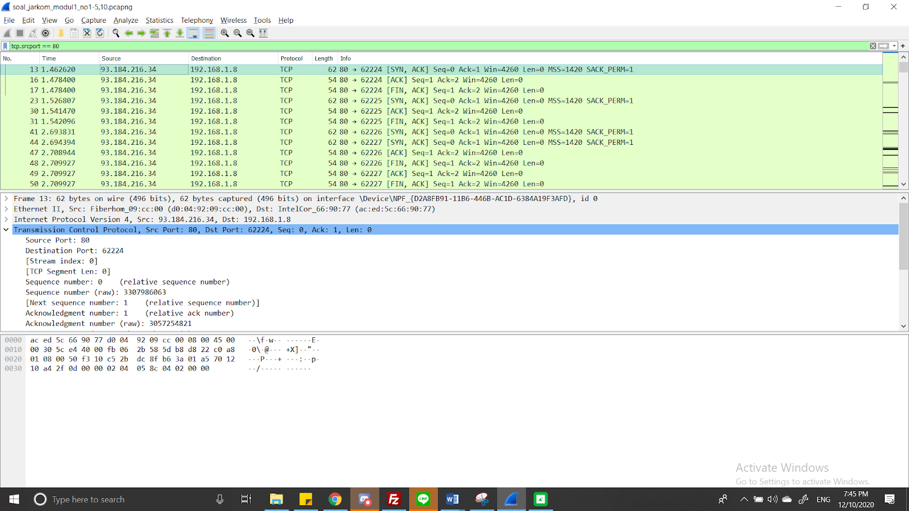

## Soal 13
### Pertanyaan: 
Filter sehingga wireshark hanya menampilkan paket yang menuju port 443!

### Jawaban:

Filter menggunakan
```
tcp.dstport == 443
```

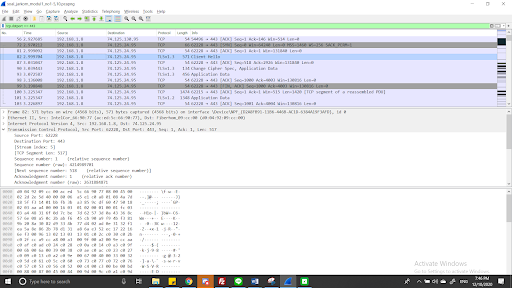

## Soal 14
### Pertanyaan: 
Filter sehingga wireshark hanya mengambil paket yang berasal dari ip kalian!

### Jawaban:

Filter menggunakan
```
ip.src == (ip masing2)
```
Ip pada Windows bisa dilihat dengan membuka cmd dan menjalankan ipconfig

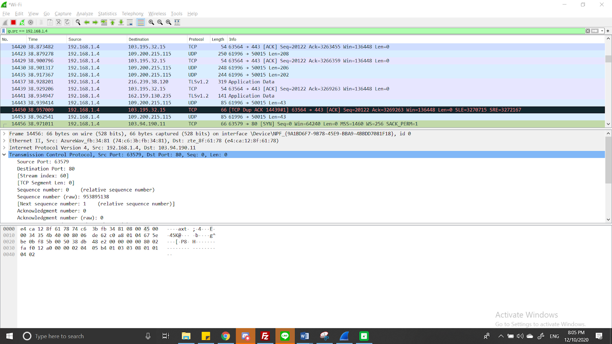

## Soal 15
### Pertanyaan: 
Filter sehingga wireshark hanya mengambil paket yang tujuannya ke monta.if.its.ac.id!

### Jawaban:

Filter menggunakan
```
ip.dst == ipnya monta
```

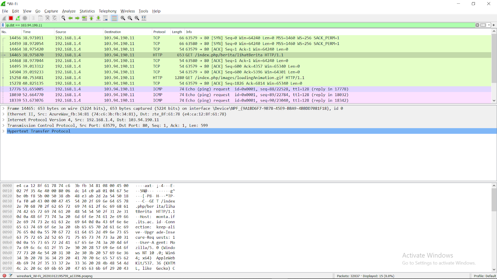