# Modul 4: Subnetting dan Routing
```
Nugroho Dimas A (05111840000075)
Zakiya Azizah C (05111840000080)
```

- [CIDR](#cidr-uml)
- [VLSM](#vlsm-cpt)

## CIDR UML
1. Menentukan subnet yang disatukan sebagai berikut
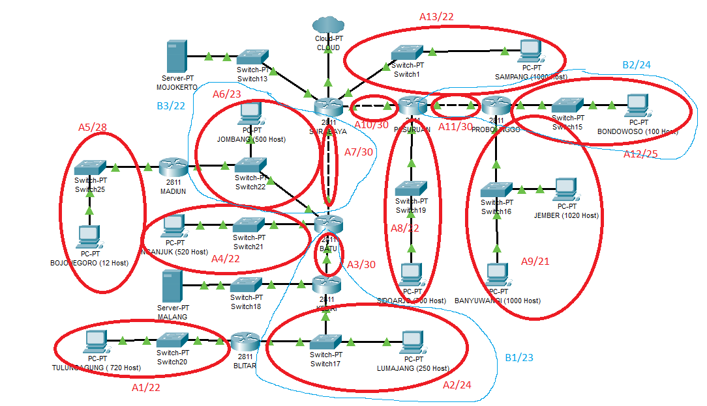

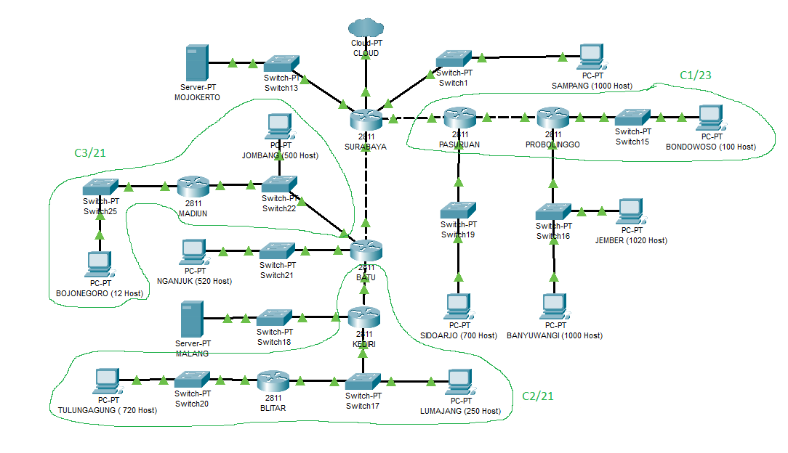

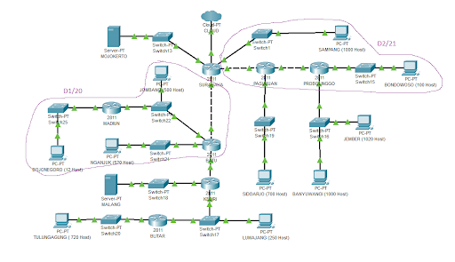

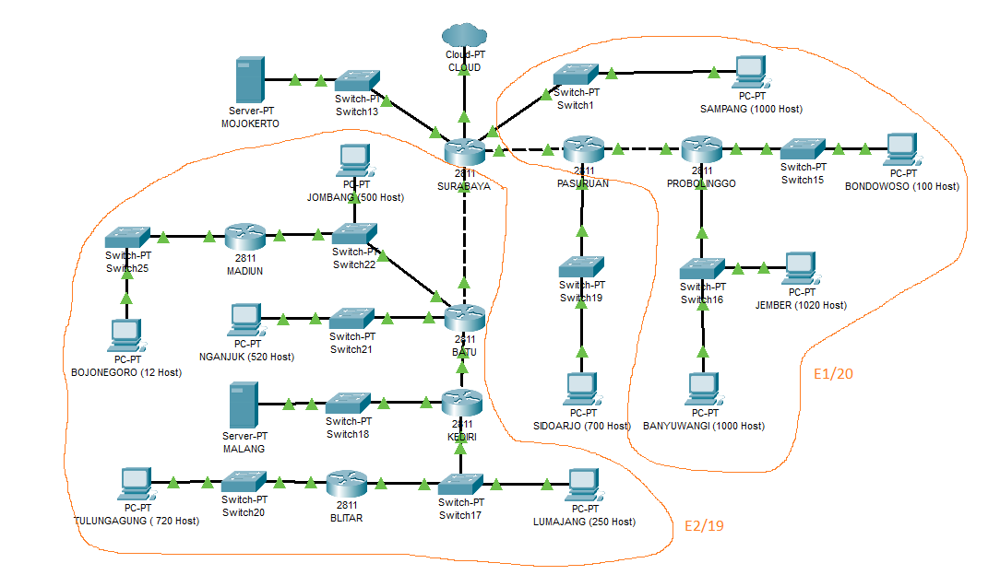

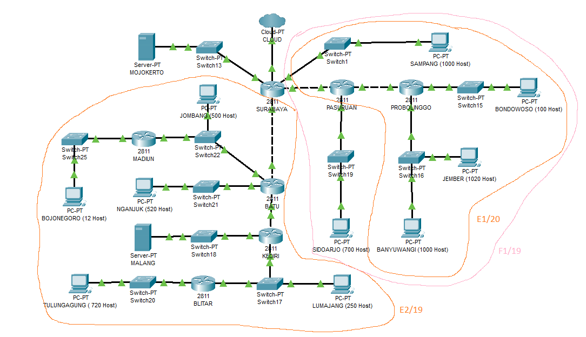

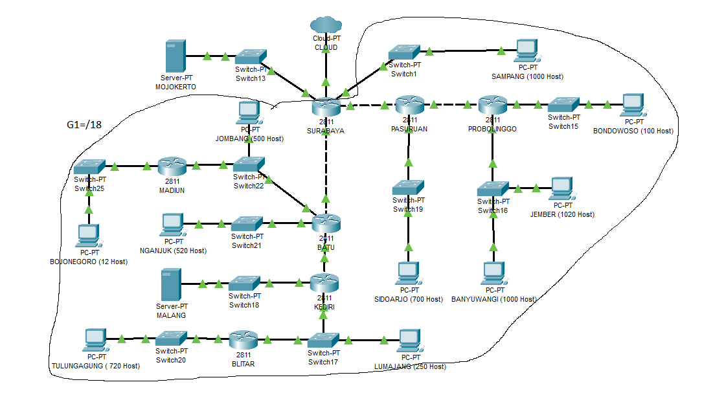

2. Membuat pohon untuk pembagian subnet
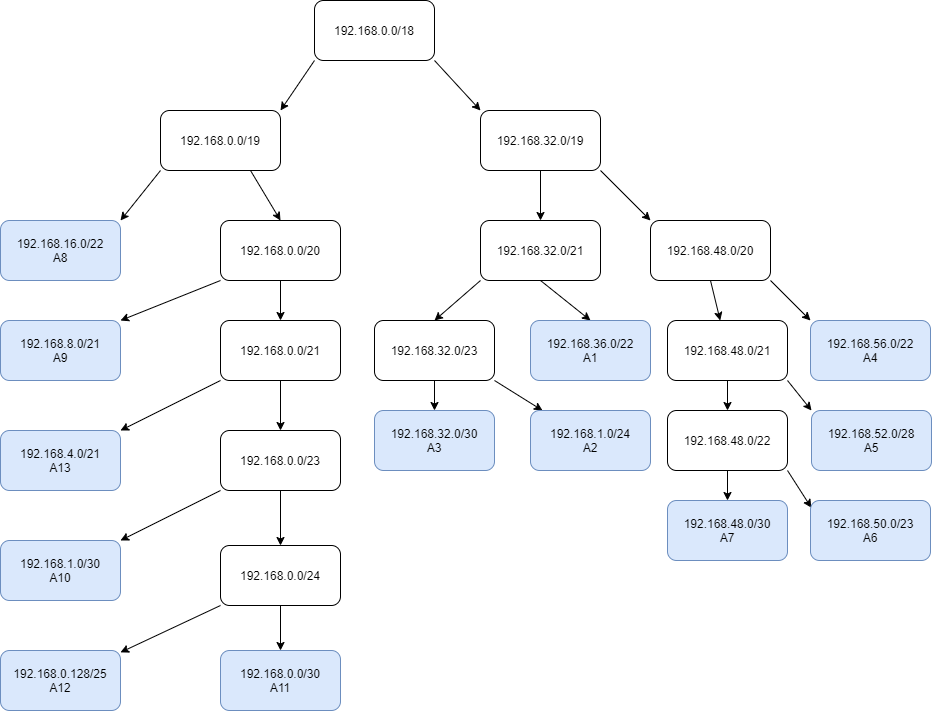

3. Mengatur Topologi
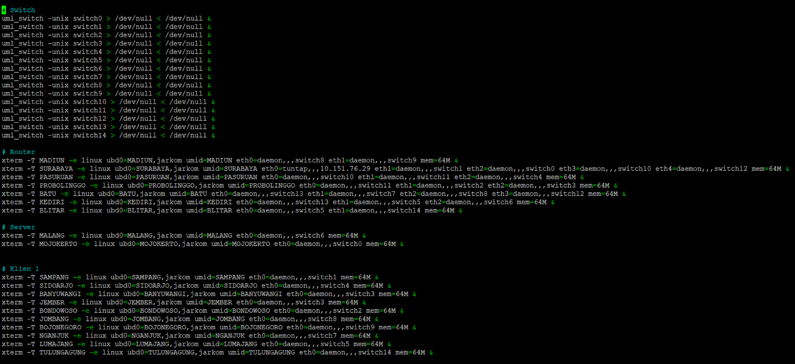

4. Atur interface masing0masing UML, contoh pada Mojokerto dan Tulungagung:
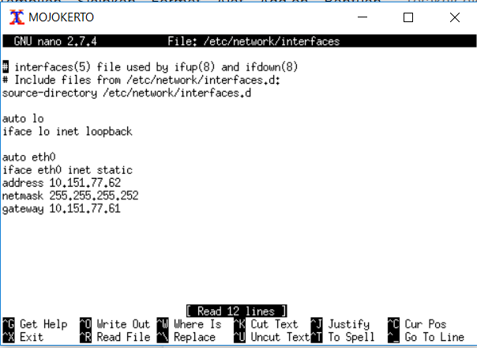
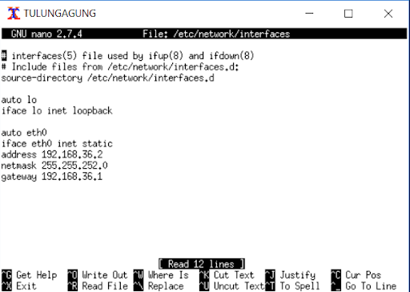

5. Setiap router perlu konfigurasi untung packet forwarding dengan cara uncomment seperti berikut
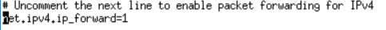

6. Routing pada masing-masing router
### SURABAYA

```
route add -net 192.168.0.128 netmask 255.255.255.128 gw 192.168.1.2 #A12
route add -net 192.168.8.0 netmask 255.255.248.0 gw 192.168.1.2 #A9
route add -net 192.168.16.0 netmask 255.255.252.0 gw 192.168.1.2 #A8 
route add -net 192.168.0.0 netmask 255.255.255.252 gw 192.168.1.2 #A11
route add -net 192.168.52.0 netmask 255.255.255.240 gw 192.168.48.2 #A5 
route add -net 192.168.50.0 netmask 255.255.254.0 gw 192.168.48.2 #A6
route add -net 192.168.56.0 netmask 255.255.252.0 gw 192.168.48.2 #A4
route add -net 192.168.32.0 netmask 255.255.255.252 gw 192.168.48.2 #A3
route add -net 192.168.36.0 netmask 255.255.252.0 gw 192.168.48.2 #A1
route add -net 192.168.1.0 netmask 255.255.255.0 gw 192.168.48.2 #A2
route add -net 10.151.77.56 netmask 255.255.255.248 gw 192.168.48.2 #SERVER MALANG
```
### PASURUAN

```
route add -net 192.168.0.128 netmask 255.255.255.128 gw 192.168.0.2 #A12
route add -net 192.168.8.0 netmask 255.255.248.0 gw 192.168.0.2 #A9
route add -net 0.0.0.0 netmask 0.0.0.0 gw 192.168.1.1 #A10 nyambung ke router SBY
```

### PROBOLINGGO

```
route add -net 0.0.0.0 netmask 0.0.0.0 gw 192.168.0.1
```

### BATU

```
route add -net 192.168.52.0 netmask 255.255.255.240 gw 192.168.50.2 #A5
route add -net 192.168.36.0 netmask 255.255.252.0 gw 192.168.32.2 #A1
route add -net 192.168.1.0 netmask 255.255.255.0 gw 192.168.32.2 #A2
route add -net 0.0.0.0 netmask 0.0.0.0 gw 192.168.48.1 #A7
route add -net 10.151.77.56 netmask 255.255.255.248 gw 192.168.32.2 //SERVER MALANG
```

### MADIUN

```
route add -net 0.0.0.0 netmask 0.0.0.0 gw 192.168.50.1 //A6
```

### KEDIRI

```
route add -net 0.0.0.0 netmask 0.0.0.0 gw 192.168.32.1 //A3
route add -net 192.168.36.0 netmask 255.255.252.0 gw 192.168.1.2 //A1
```

### BLITAR

```
route add -net 0.0.0.0 netmask 0.0.0.0 gw 192.168.1.1 //A2
```

## VLSM CPT

1. Menentukan area subnet seperti berikut
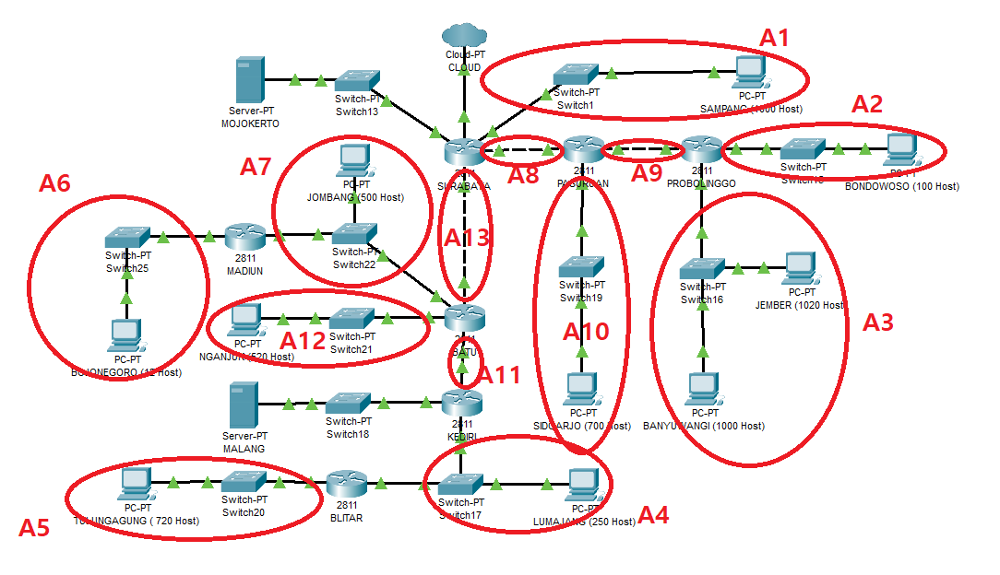

2. Menentukan pembagian ip dan subnet mask

| Subnet | Host | Lenght | Submask         | NID 
| ------ | :--: | :----: | --------------- | -- 
| A1     | 1001 | /22    | 255.255.252.0   | 192.168.4.0
| A2     | 101  | /25    | 255.255.255.128 | 192.168.0.128
| A3     | 2021 | /21    | 255.255.248.0   | 192.168.24.0
| A4     | 251  | /24    | 255.255.255.0   | 192.168.1.0
| A5     | 721  | /22    | 255.255.252.0   | 192.168.8.0
| A6     | 13   | /28    | 255.255.255.240 | 192.168.0.16
| A7     | 23   | /27    | 255.255.255.224 | 192.168.0.32
| A8     | 2    | /30    | 255.255.255.252 | 192.168.0.12
| A9     | 2    | /30    | 255.255.255.252 | 192.168.0.8
| A10    | 701  | /22    | 255.255.255.0   | 192.168.12.0
| A11    | 2    | /30    | 255.255.255.252 | 192.168.0.4
| A12    | 521  | /22    | 255.255.252.0   | 182.168.16.0
| A13    | 2    | /30    | 255.255.255.252 | 192.168.0.0
| Total  | 5361 | /19    |

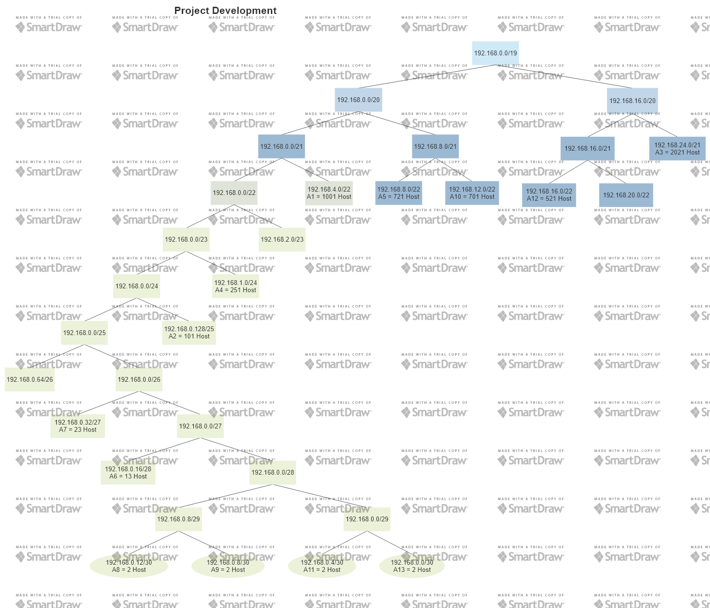

4. Membuat topologi di cpt
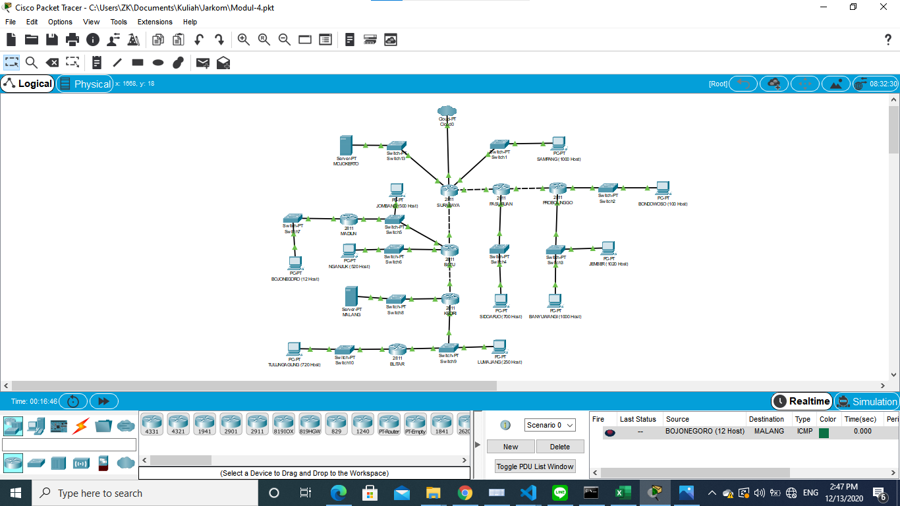

5. Mengatur ip pada setiap router, client, dan server. Jangan lupa mengatur gateway pada server. Contoh pada a8, a10, server mojokerto, secara berurut.
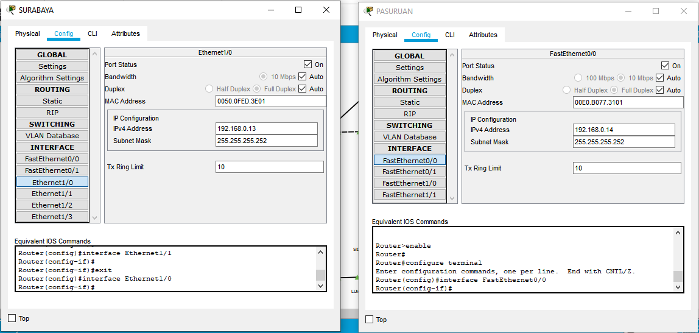

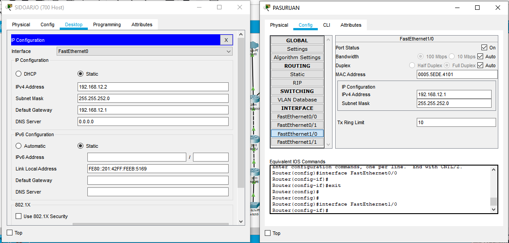

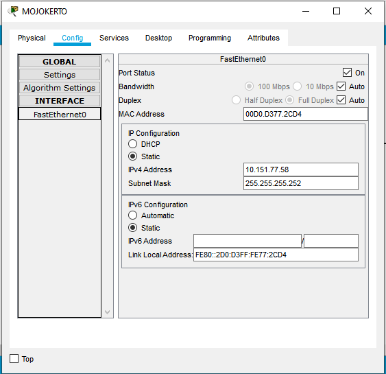

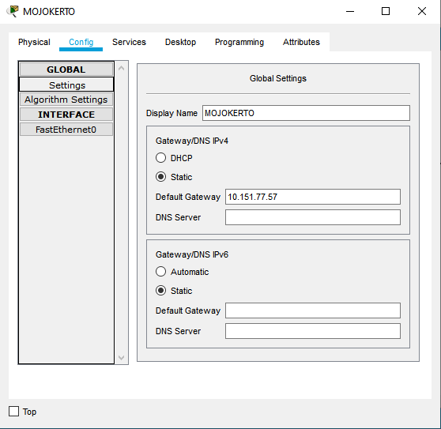

6. Menentukan routing
- Surabaya
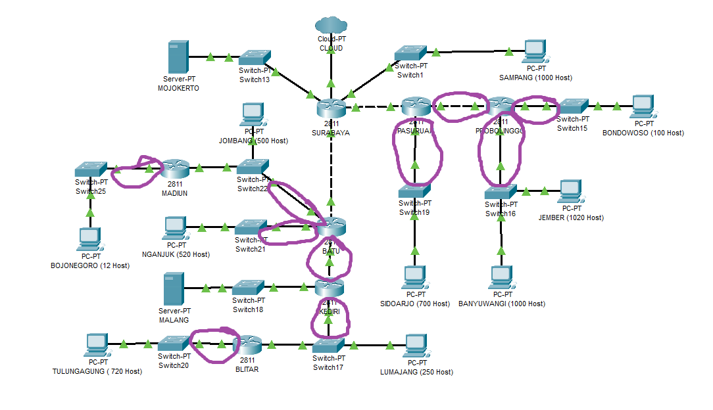

- Pasuruan
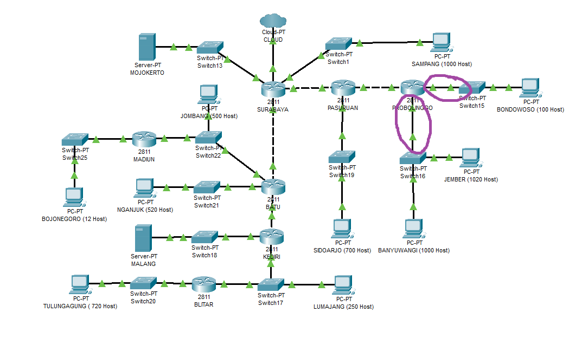

- Batu
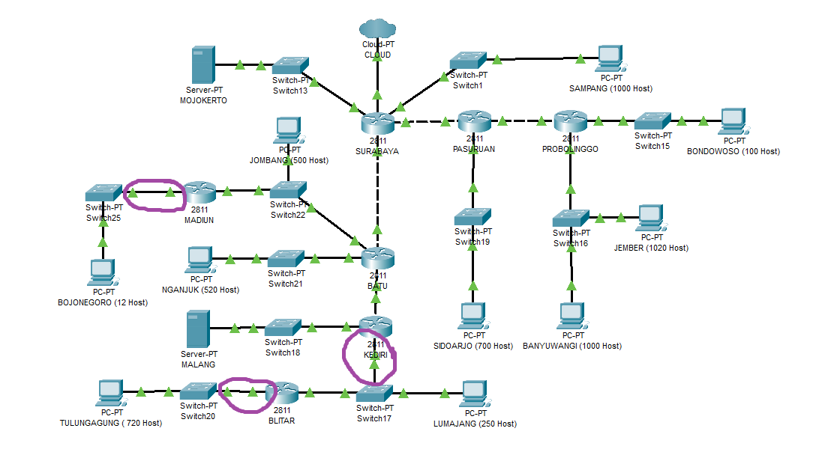

- Kediri
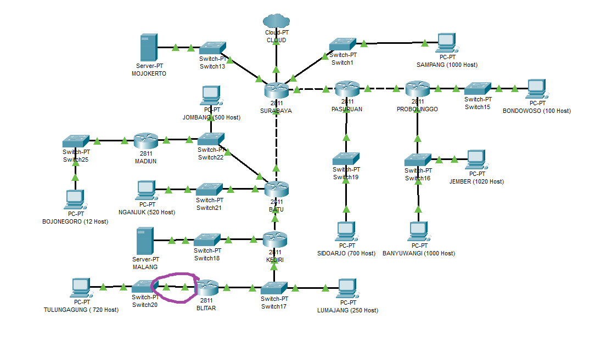

7. Mengatur routing pada cpt, contoh sby ke a10
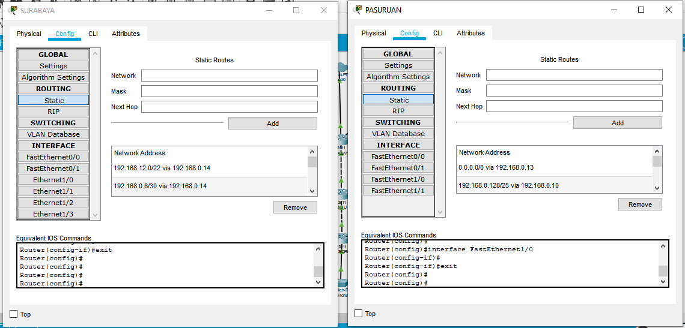

8. Coba ping

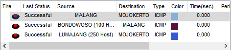
