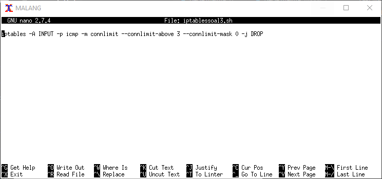

# Modul 5: Firewall
```
Nugroho Dimas A (05111840000075)
Zakiya Azizah C (05111840000080)
```

## SOAL A dan B - Topologi (VLSM)

1. Membagi ke beberapa area subnet


2. Membangun pohon dan pembagian IP


## SOAL C

Melakukan routing pada uml route (Surabaya, Batu, Kediri)

### Surabaya


### Batu


### Kediri


## SOAL D - DHCP


## SOAL 1
di SURABAYA
Menggunakan NAT dengan SNAT menuju ke gateway Surabaya


## SOAL 2
di SURABAYA
SSH dari port 2. Testing dengan nc ip port dari putty, jika tidak keluar apa2 berarti terdrop


## SOAL 3
di MALANG dan MOJOKERTO



## SOAL 4
di MALANG


## SOAL 5
di MALANG


## SOAL 6
di MOJOKERTO


## SOAL 7
di SURABAYA, MALANG, MOJOKERTO
contoh:
